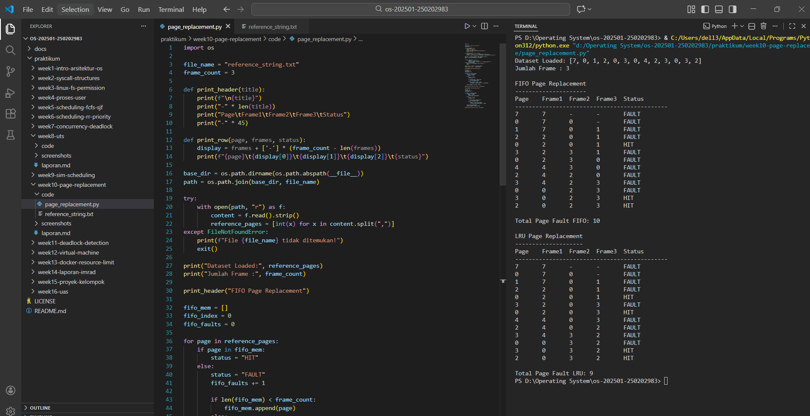

# Laporan Praktikum Minggu [X]
Topik: Manajemen Memori – Page Replacement (FIFO & LRU)

---

## Identitas
- **Nama**  : Sukmani Intan Jumala
- **NIM**   : 250202983
- **Kelas** : 1 IKRA

---

## Tujuan
1. Mengimplementasikan FIFO  
2. Mengimplementasikan LRU  
3. Menjalankan simulasi  
4. Membandingkan jumlah page fault  
5. Menyajikan hasil secara sistematis

---

## Dasar Teori
1. Memori Virtual  
Memori virtual memungkinkan sistem menjalankan program seolah-olah memiliki memori utama yang lebih besar daripada kapasitas fisik sebenarnya. Setiap alamat virtual diterjemahkan ke alamat fisik, sehingga penggunaan memori menjadi lebih efisien dan mendukung multitasking (Silberschatz et al., 2018; Tanenbaum, 2015).  
2. Page dan Frame  
Memori utama dibagi menjadi frame, sedangkan program dibagi menjadi page. Apabila page yang dibutuhkan tidak berada di memori, sistem mengalami page fault.  
3. Page Replacement  
Page replacement adalah proses mengganti page lama di memori ketika terjadi page fault dan frame memori penuh. Pemilihan page yang diganti dilakukan berdasarkan algoritma tertentu (Silberschatz et al., 2018).  
4. Algoritma Page Replacement  
FIFO (First-In First-Out): mengganti page yang paling lama berada di memori.  
LRU (Least Recently Used): mengganti page yang paling lama tidak digunakan, umumnya menghasilkan jumlah page fault lebih sedikit dibanding FIFO.

---

## Langkah Praktikum
1. **Menyiapkan Dataset**

   Gunakan *reference string* berikut sebagai contoh:
   ```
   7, 0, 1, 2, 0, 3, 0, 4, 2, 3, 0, 3, 2
   ```
   Jumlah frame memori: **3 frame**.

2. **Implementasi FIFO**

   - Simulasikan penggantian halaman menggunakan algoritma FIFO.
   - Catat setiap *page hit* dan *page fault*.
   - Hitung total *page fault*.

3. **Implementasi LRU**

   - Simulasikan penggantian halaman menggunakan algoritma LRU.
   - Catat setiap *page hit* dan *page fault*.
   - Hitung total *page fault*.

4. **Eksekusi & Validasi**

   - Jalankan program untuk FIFO dan LRU.
   - Pastikan hasil simulasi logis dan konsisten.
   - Simpan screenshot hasil eksekusi.

5. **Analisis Perbandingan**

   Buat tabel perbandingan seperti berikut:

   | Algoritma | Jumlah Page Fault | Keterangan |
   |:--|:--:|:--|
   | FIFO | ... | ... |
   | LRU | ... | ... |


   - Jelaskan mengapa jumlah *page fault* bisa berbeda.
   - Analisis algoritma mana yang lebih efisien dan alasannya.

6. **Commit & Push**

   ```bash
   git add .
   git commit -m "Minggu 10 - Page Replacement FIFO & LRU"
   git push origin main
   ```

---

## Kode / Perintah  
Import & Konfigurasi  
```bash
import os

file_name = "reference_string.txt"
frame_count = 3
```  
Fungsi Bantu Untuk Menampilkan Output
```bash
def print_header(title):
    print(f"\n{title}")
    print("-" * len(title))
    print("Page\tFrame1\tFrame2\tFrame3\tStatus")
    print("-" * 45)

def print_row(page, frames, status):
    display = frames + ['-'] * (frame_count - len(frames))
    print(f"{page}\t{display[0]}\t{display[1]}\t{display[2]}\t{status}")
```  
Load Dataset dari File
```bash
base_dir = os.path.dirname(os.path.abspath(__file__))
path = os.path.join(base_dir, file_name)

try:
    with open(path, "r") as f:
        content = f.read().strip()
        reference_pages = [int(x) for x in content.split(",")]
except FileNotFoundError:
    print(f"File {file_name} tidak ditemukan!")
    exit()
```
Menampilkan info awal  
```bash
print("Dataset Loaded:", reference_pages)
print("Jumlah Frame :", frame_count)
```  
Simulasi FIFO (First In, First Out)
```bash
print_header("FIFO Page Replacement")

fifo_mem = []
fifo_index = 0
fifo_faults = 0

for page in reference_pages:
    if page in fifo_mem:
        status = "HIT"
    else:
        status = "FAULT"
        fifo_faults += 1

        if len(fifo_mem) < frame_count:
            fifo_mem.append(page)
        else:
            fifo_mem[fifo_index] = page
            fifo_index = (fifo_index + 1) % frame_count

    print_row(page, fifo_mem, status)

print("\nTotal Page Fault FIFO:", fifo_faults)
```
Simulasi LRU (Least Recently Used)
```bash
print_header("LRU Page Replacement")

lru_mem = []
recent_order = []  
lru_faults = 0

for page in reference_pages:
    if page in lru_mem:
        status = "HIT"
        recent_order.remove(page)
    else:
        status = "FAULT"
        lru_faults += 1

        if len(lru_mem) < frame_count:
            lru_mem.append(page)
        else:
            oldest = recent_order.pop(0)
            lru_mem[lru_mem.index(oldest)] = page

    recent_order.append(page)
    print_row(page, lru_mem, status)

print("\nTotal Page Fault LRU:", lru_faults)
```
---

## Hasil Eksekusi


---

## Analisis
- Tabel Perbandingan  
  | Algoritma | Jumlah Page Fault | Keterangan |
  |:--|:--:|:--|
  | FIFO | 10 | Mengganti halaman berdasarkan urutan masuk (paling lama di memori) |
  | LRU | 9 | Mengganti halaman yang paling lama tidak digunakan |
 
- Mengapa jumlah pegae fault bisa berbeda?
  Jumlah page fault berbeda pastinya karena strategi penggantian halaman yang berbeda. FIFO mengganti halaman yang paling lama di memori, tanpa melihat apakah halaman itu sering digunakan atau tidak. Sedangkan LRU, mengganti halaman yang paling lama tidak digunakan dan untuk yang sering digunakan tetpa berada di memori
- Analisis algoritma mana yang lebih efisien dan alasannya!
  Dari simulasi ini, LRU lebih efisien karena page fault lebih sedikit yaitu 9 vs 10 untuk FIFO. FIFO sebenarnya lebih sederhana tapi dengan mengganti halaman yang masih sering dipakai dapat menyebabkan page fault lebih banyak.

---

## Kesimpulan  
Dari praktikum ini, dapat disimpulkan bahwa FIFO dan LRU adalah algoritma untuk mengganti halaman di memori saat terjadi page fault. FIFO mengganti halaman yang paling lama berada di memori, sedangkan LRU mengganti halaman yang paling lama tidak digunakan. Dari simulasi dengan 3 frame, FIFO menghasilkan 10 page fault dan LRU 9 page fault, menunjukkan bahwa LRU lebih efisien karena halaman yang sering dipakai tetap di memori. Praktikum ini membantu memahami bagaimana sistem operasi menangani page fault dan perbedaan performa kedua algoritma.  

---

## Quiz
1. Apa perbedaan utama FIFO dan LRU?
   Perbedaan ada pada kriteria penggantiannya, pada FIFO halaman yang masuk lebih dulu akan keluar lebih dulu (berdasarkan waktu masuk), sedangkan pada LRU halaman yang paling lama tidak diakses akan dikeluarkan terlebih dahulu (berdasarkan waktu akses terakhir)
2. Mengapa FIFO dapat menghasilkan *Belady’s Anomaly*?
   Karena FIFO mengganti halaman hanya berdasarkan usia, bukan kegunaan. FIFO hanya mengandalkan urutan masuk tanpa memperhatikan pola penggunaan. Jadi halaman yang sebenarnya sering dipakai bisa ikut terganti.
3. Mengapa LRU umumnya menghasilkan performa lebih baik dibanding FIFO?
   Karena pendekatan LRU lebih cerdas dalam memprediksi kebutuhan di masa mendatang, sehingga halaman yang sering diakses akan tetap berada di memori. Dengan begitu, jumlah page fault lebih sedikit.
   
---

## Refleksi Diri
Tuliskan secara singkat:
- Apa bagian yang paling menantang minggu ini?
  Memahami cara kerja LRU supaya page fault bisa dihitung dengan benar.
- Bagaimana cara Anda mengatasinya?
  Membaca teori lagi, melihat contoh FIFO, dan mencoba langkah demi langkah sambil mencatat page hit dan page fault.

---

**Credit:**  
_Template laporan praktikum Sistem Operasi (SO-202501) – Universitas Putra Bangsa_
