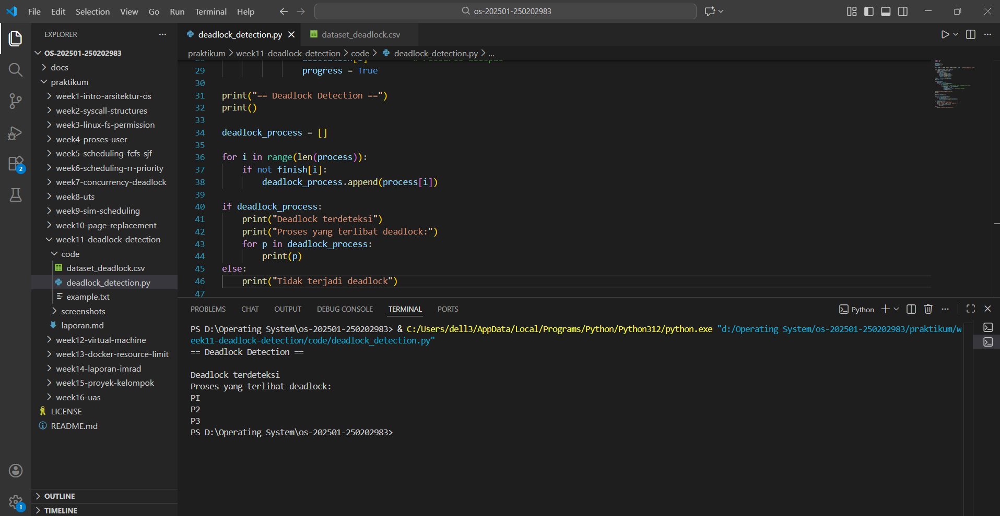

# Laporan Praktikum Minggu [X]
Topik: Simulasi dan Deteksi Deadlock

---

## Identitas
- **Nama**  : Sukmani Intan Jumala
- **NIM**   : 250202983
- **Kelas** : 1 IKRA

---

## Tujuan
Tuliskan tujuan praktikum minggu ini.  
Contoh:  
> Mahasiswa mampu menjelaskan fungsi utama sistem operasi dan peran kernel serta system call.

---

## Dasar Teori
Tuliskan ringkasan teori (3–5 poin) yang mendasari percobaan.

---

## Langkah Praktikum
1. **Menyiapkan Dataset**

   Gunakan dataset sederhana yang berisi:
   - Daftar proses  
   - Resource Allocation  
   - Resource Request / Need

   Contoh tabel:

   | Proses | Allocation | Request |
   |:--:|:--:|:--:|
   | P1 | R1 | R2 |
   | P2 | R2 | R3 |
   | P3 | R3 | R1 |

2. **Implementasi Algoritma Deteksi Deadlock**

   Program minimal harus:
   - Membaca data proses dan resource.  
   - Menentukan apakah sistem berada dalam kondisi deadlock.  
   - Menampilkan proses mana saja yang terlibat deadlock.

3. **Eksekusi & Validasi**

   - Jalankan program dengan dataset uji.  
   - Validasi hasil deteksi dengan analisis manual/logis.  
   - Simpan hasil eksekusi dalam bentuk screenshot.

4. **Analisis Hasil**

   - Sajikan hasil deteksi dalam tabel (proses deadlock / tidak).  
   - Jelaskan mengapa deadlock terjadi atau tidak terjadi.  
   - Kaitkan hasil dengan teori deadlock (empat kondisi).

5. **Commit & Push**

   ```bash
   git add .
   git commit -m "Minggu 11 - Deadlock Detection"
   git push origin main
   ```

---

## Kode / Perintah
```bash
import csv
import os

process = []
allocation = []
request = []

file_path = os.path.join(os.path.dirname(__file__), "dataset_deadlock.csv")

with open(file_path, "r") as file:
    reader = csv.reader(file)
    next(reader)
    for row in reader:
        process.append(row[0])
        allocation.append(row[1])
        request.append(row[2])

finish = [False] * len(process)
progress = True

while progress:
    progress = False
    for i in range(len(process)):
        if not finish[i]:
            # jika resource yang diminta tidak dipegang proses lain
            if request[i] not in allocation:
                finish[i] = True
                allocation[i] = "-"   # resource dilepas
                progress = True

print("== Deadlock Detection ==")
print()

deadlock_process = []

for i in range(len(process)):
    if not finish[i]:
        deadlock_process.append(process[i])

if deadlock_process:
    print("Deadlock terdeteksi")
    print("Proses yang terlibat deadlock:")
    for p in deadlock_process:
        print(p)
else:
    print("Tidak terjadi deadlock")
```

---

## Hasil Eksekusi
Sertakan screenshot hasil percobaan atau diagram:


---

## Analisis
- Tabel Hasil Deteksi
  | Proses | Status | 
  | P1 | deadlock | 
  | P2 | deadlock |
  | P3 | deadlock |
- Validasi Manual
  - P1 menunggu R2 yang dipegang P2
  - P2 menunggu R3 yang dipegang P3
  - P3 menunggu R1 yang dipegang P1
    Maka terjadi circular wait. Tidak ada proses yang bisa lanjut sehingga hasil program sudah sesuai dengan analisis manual.
- Berdasarkan hasil eksekusi program menggunakan dataset uji, Sistem terdeteksi mengalami deadlock


---

## Kesimpulan
Tuliskan 2–3 poin kesimpulan dari praktikum ini.

---

## Quiz
1. [Pertanyaan 1]  
   **Jawaban:**  
2. [Pertanyaan 2]  
   **Jawaban:**  
3. [Pertanyaan 3]  
   **Jawaban:**  

---

## Refleksi Diri
Tuliskan secara singkat:
- Apa bagian yang paling menantang minggu ini?  
- Bagaimana cara Anda mengatasinya?  

---

**Credit:**  
_Template laporan praktikum Sistem Operasi (SO-202501) – Universitas Putra Bangsa_
