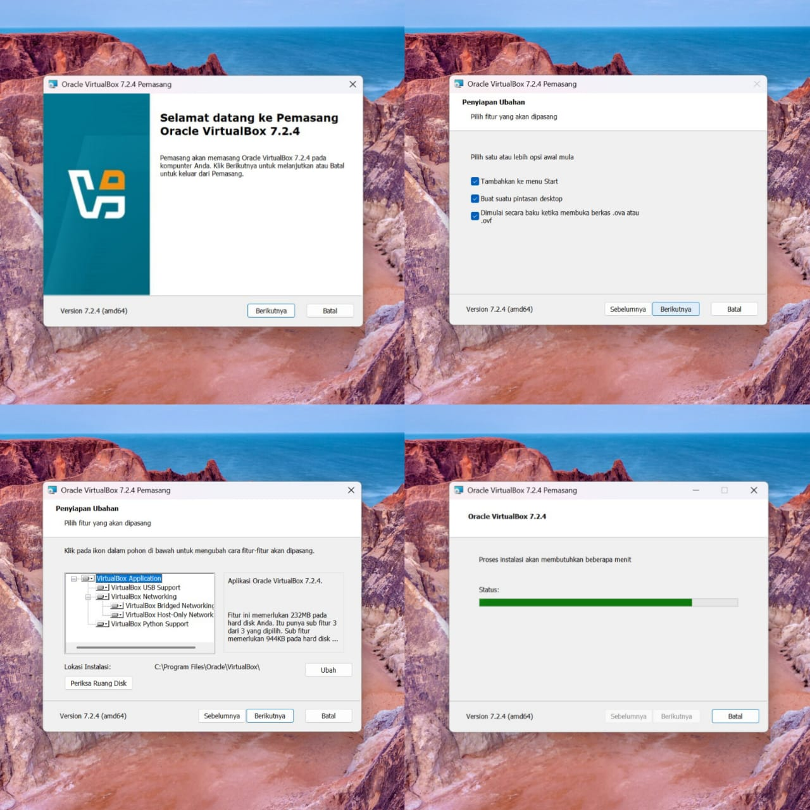
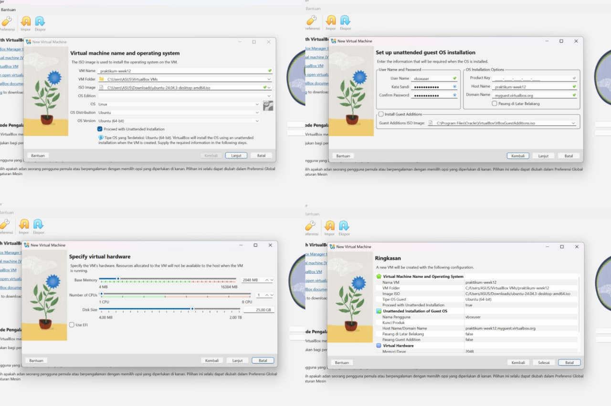
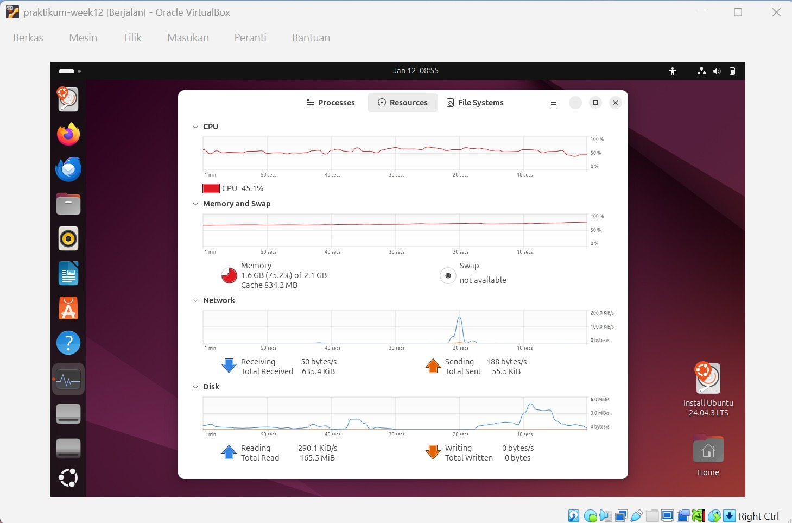
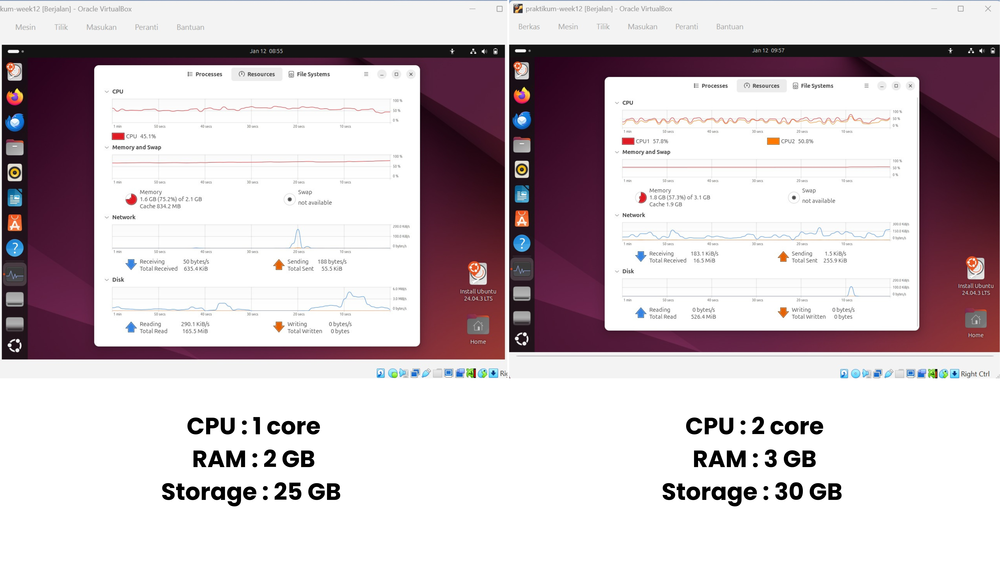

# Laporan Praktikum Minggu 12
Topik: Virtualisasi Menggunakan Virtual Machine

---

## Identitas
- **Nama**  : 
  - Sukmani Intan Jumala (250202983)
  - Novia Safitri (250202923)
  - Putri Amaliya Ramadani (250202924)
- **Kelas** : 1 IKRA

---

## Tujuan
Setelah menyelesaikan tugas ini, mahasiswa mampu:
1. Menginstal perangkat lunak virtualisasi (VirtualBox/VMware).
2. Membuat dan menjalankan sistem operasi guest di dalam VM.
3. Mengatur konfigurasi resource VM (CPU, RAM, storage).
4. Menjelaskan mekanisme proteksi OS melalui virtualisasi.
5. Menyusun laporan praktikum instalasi dan konfigurasi VM secara sistematis.

---

## Dasar Teori
1. Virtualisasi Sistem Operasi  
Virtualisasi adalah teknologi yang memungkinkan satu perangkat keras menjalankan lebih dari satu sistem operasi secara bersamaan melalui Virtual Machine (VM). Setiap sistem operasi berjalan di lingkungan terpisah sehingga penggunaan resource lebih efisien dan tidak saling mengganggu.  
2. Virtual Machine (VM)  
Virtual Machine merupakan komputer virtual yang memiliki sistem operasi dan resource sendiri. VM berjalan di atas software virtualisasi dan bersifat independen, sehingga kesalahan pada satu VM tidak memengaruhi sistem utama.  
3. Host OS dan Guest OS  
Host OS adalah sistem operasi utama yang terpasang pada hardware fisik, sedangkan guest OS dijalankan di dalam VM. Guest OS tidak berinteraksi langsung dengan hardware karena seluruh akses resource diatur oleh sistem virtualisasi.  
4. Hypervisor  
Hypervisor adalah perangkat lunak yang mengelola VM dan membagi resource seperti CPU, RAM, dan storage. Hypervisor juga berperan menjaga isolasi antara host dan guest agar sistem tetap aman.  
5. Isolasi, Sandboxing, dan Hardening OS  
Virtualisasi menyediakan isolasi sistem yang berkaitan dengan konsep sandboxing dan hardening OS. Guest OS dapat digunakan sebagai lingkungan uji coba instalasi dan konfigurasi sistem tanpa risiko merusak host OS.  

---

## Langkah Praktikum
1. **Instalasi Virtual Machine**
   - Instal VirtualBox atau VMware pada komputer host.  
   - Pastikan fitur virtualisasi (VT-x / AMD-V) aktif di BIOS.

2. **Pembuatan OS Guest**
   - Buat VM baru dan pilih OS guest (misal: Ubuntu Linux).  
   - Atur resource awal:
     - CPU: 1–2 core  
     - RAM: 2–4 GB  
     - Storage: ≥ 20 GB

3. **Instalasi Sistem Operasi**
   - Jalankan proses instalasi OS guest sampai selesai.  
   - Pastikan OS guest dapat login dan berjalan normal.

4. **Konfigurasi Resource**
   - Ubah konfigurasi CPU dan RAM.  
   - Amati perbedaan performa sebelum dan sesudah perubahan resource.

5. **Analisis Proteksi OS**
   - Jelaskan bagaimana VM menyediakan isolasi antara host dan guest.  
   - Kaitkan dengan konsep *sandboxing* dan *hardening* OS.

6. **Dokumentasi**
   - Ambil screenshot setiap tahap penting.  
   - Simpan di folder `screenshots/`.

7. **Commit & Push**
   ```bash
   git add .
   git commit -m "Minggu 12 - Virtual Machine"
   git push origin main
   ```

---

## Hasil Eksekusi  
Dokumentasi Proses Instalasi Virtual Machine
  

Dokumentasi Proses Konfigurasi Resource
   

OS guest running  
  

Perbedaan performa sebelum dan sesudah perubahan resource
  

---

## Analisis  
- Bagaimana VM menyediakan isolasi antara host dan guest?
  
  Pada penggunaan Virtual Machine, sistem operasi guest dijalankan di lingkungan software yang terpisah dari sistem utama pada hardware komputer. Guest OS tidak berinteraksi langsung dengan hardware fisik karena seluruh akses resource seperti CPU, RAM, dan storage diatur oleh software virtualisasi. Dengan mekanisme ini, aktivitas yang terjadi di dalam guest OS tidak memengaruhi sistem utama. Jika terjadi kesalahan sistem atau crash pada guest OS, hardware dan sistem utama tetap berjalan normal dan aman.
- Kaitkan dengan konsep *sandboxing* dan *hardening* OS
  
  Isolasi pada Virtual Machine mencerminkan konsep *sandboxing*, yaitu menjalankan sistem atau proses dalam lingkungan terbatas. Guest OS berfungsi sebagai ruang uji coba. Jadi, pada saat error, crash, atau kesalahan saat instalasi, dampaknya hanya ada di Virtual Machine dan tidak berdampak pada sistem utama maupun hardware fisik.  
  Virtual Machine mendukung *hardening* OS karena guest OS dapat digunakan untuk mencoba pengaturan sistem (konfigurasi) dan keamanan terlebih dulu. Semua percobaan bisa dilakukan tanpa takut merusak sistem utama, sehingga sistem bisa dibuat lebih aman sebelum digunakan secara nyata.
- Perbedaan performa sebelum dan sesudah perubahan resource
  
  Pada praktikum ini dilakukan penyesuaian konfigurasi resource untuk melihat dampaknya terhadap kinerja guest OS.  
**Konfigurasi Awal**  
CPU: 1 core  
RAM: 2 GB  
Storage: 25 GB  
Dengan konfigurasi ini, pemakaian CPU cenderung tinggi walaupun hanya menjalankan proses dasar. Sistem terasa lambat, terutama saat membuka aplikasi dan berpindah menu. Penggunaan RAM juga cukup besar jika dibandingkan dengan kapasitas yang tersedia, sehingga kinerja sistem menjadi kurang optimal.  
**Konfigurasi Setelah Diubah**  
CPU: 2 core   
RAM: 3 GB    
Storage: 30 GB  
Setelah resource ditambah, performa guest OS menjadi lebih baik. Beban CPU terbagi ke dua core sehingga sistem bekerja lebih stabil. Penambahan RAM membantu proses berjalan lebih lancar dan mengurangi jeda saat membuka aplikasi. Secara keseluruhan, sistem terasa lebih responsif dengan pemanfaatan resource yang lebih seimbang.  
 

---

## Kesimpulan
Pada praktikum Virtual Machine dapat kami simpulkan bahwa:   
1. Virtualisasi memungkinkan menjalankan sistem operasi guest di dalam satu komputer tanpa mengganggu sistem utama karena guest OS berjalan di lingkungan terpisah meskipun menggunakan hardware yang sama.
2. Pengaturan resource seperti CPU, RAM, dan storage sangat memengaruhi performa guest OS, di mana konfigurasi yang tepat membuat sistem lebih stabil dan responsif, serta membantu kami memahami manajemen resource pada VM.
3. Virtual Machine meningkatkan keamanan sistem melalui isolasi, sandboxing, dan hardening OS, sehingga guest OS dapat digunakan sebagai lingkungan uji coba tanpa merusak host OS.  

---

## Quiz
1. Apa perbedaan antara host OS dan guest OS?  
2. Apa peran hypervisor dalam virtualisasi?  
3. Mengapa virtualisasi meningkatkan keamanan sistem?  

---

## Refleksi Diri
Tuliskan secara singkat:
- Apa bagian yang paling menantang minggu ini?  
- Bagaimana cara Anda mengatasinya?  

---

**Credit:**  
_Template laporan praktikum Sistem Operasi (SO-202501) – Universitas Putra Bangsa_
