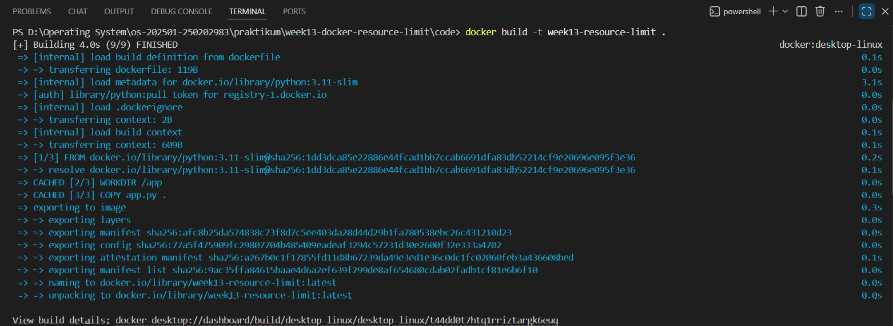
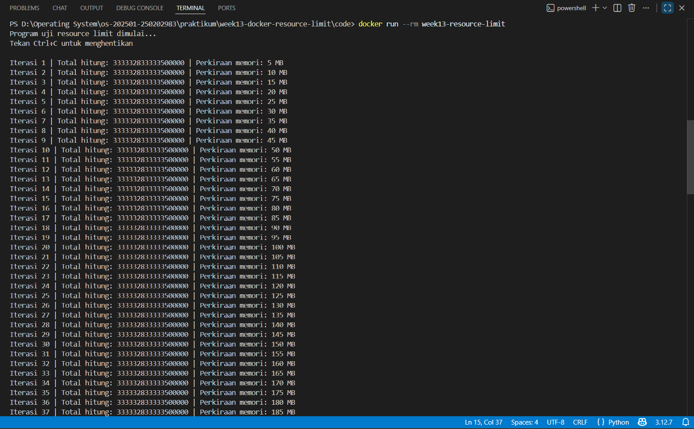
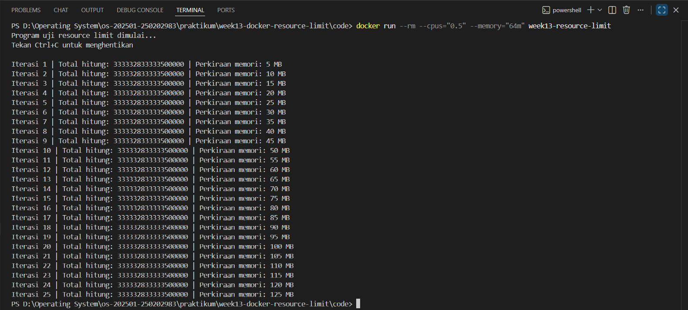
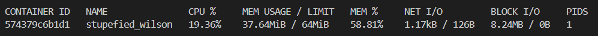

# Laporan Praktikum Minggu 13
Topik: Docker – Resource Limit (CPU & Memori)

---

## Identitas
- **Nama**  : Sukmani Intan Jumala  
- **NIM**   : 250202983
- **Kelas** : 1 IKRA

---

## Tujuan
Setelah menyelesaikan tugas ini, mahasiswa mampu:  
1. Menulis Dockerfile sederhana untuk sebuah aplikasi/skrip.
2. Membangun image dan menjalankan container.
3. Menjalankan container dengan pembatasan CPU dan memori.
4. Mengamati dan menjelaskan perbedaan eksekusi container dengan dan tanpa limit resource.
5. Menyusun laporan praktikum secara runtut dan sistematis.

---

## Dasar Teori
1. Docker dan Container  
Docker adalah platform yang menjalankan aplikasi dalam container yang terisolasi. Container lebih ringan dibandingkan Virtual Machine karena berbagi kernel sistem operasi hostion yang menjalankan aplikasi dalam container terisolasi. Container berbagi kernel sistem operasi host sehingga lebih ringan dibandingkan Virtual Machine.  
2. Isolasi dan Kontrol Resource  
Docker menggunakan fitur kernel Linux seperti namespaces dan cgroups untuk mengisolasi proses serta mengatur penggunaan resource CPU dan memori pada setiap container.  
3. Pembatasan CPU dan Memori  
Docker menyediakan pengaturan limit CPU dan memori untuk mencegah container menggunakan resource secara berlebihan. Jika limit diterapkan, performa aplikasi dapat menurun atau proses dihentikan ketika melewati batas.  
4. Manfaat Resource Limit  
Pembatasan resource membantu menjaga kestabilan sistem, efisiensi penggunaan resource, dan mencegah gangguan pada container lain maupun sistem host.

---

## Langkah Praktikum
1. **Persiapan Lingkungan**

   - Pastikan Docker terpasang dan berjalan.
   - Verifikasi:
     ```bash
     docker version
     docker ps
     ```

2. **Membuat Aplikasi/Skrip Uji**

   Buat program sederhana di folder `code/` (bahasa bebas) yang:
   - Melakukan komputasi berulang (untuk mengamati limit CPU), dan/atau
   - Mengalokasikan memori bertahap (untuk mengamati limit memori).

3. **Membuat Dockerfile**

   - Tulis `Dockerfile` untuk menjalankan program uji.
   - Build image:
     ```bash
     docker build -t week13-resource-limit .
     ```

4. **Menjalankan Container Tanpa Limit**

   - Jalankan container normal:
     ```bash
     docker run --rm week13-resource-limit
     ```
   - Catat output/hasil pengamatan.

5. **Menjalankan Container Dengan Limit Resource**

   Jalankan container dengan batasan resource (contoh):
   ```bash
   docker run --rm --cpus="0.5" --memory="256m" week13-resource-limit
   ```
   Catat perubahan perilaku program (mis. lebih lambat, error saat memori tidak cukup, dll.).

6. **Monitoring Sederhana**

   - Jalankan container (tanpa `--rm` jika perlu) dan amati penggunaan resource:
     ```bash
     docker stats
     ```
   - Ambil screenshot output eksekusi dan/atau `docker stats`.

7. **Commit & Push**

   ```bash
   git add .
   git commit -m "Minggu 13 - Docker Resource Limit"
   git push origin main
   ```

---

## Kode / Perintah
```bash
docker build -t week13-resource-limit .
docker run --rm week13-resource-limit
docker run --rm --cpus="0.5" --memory="64m" week13-resource-limit
docker stats
```

app.py 
```bash
import time

data = []
i = 0

print("Program uji resource limit dimulai...")
print("Tekan Ctrl+C untuk menghentikan\n")

try:
    while True:
        total = 0
        for x in range(1_000_000):
            total += x * x

        data.append("X" * 5_000_000)

        i += 1
        print(f"Iterasi {i} | Total hitung: {total} | Perkiraan memori: {len(data)*5} MB")

        time.sleep(1)
except MemoryError:
    print("ERROR: Memori tidak cukup! Container terkena limit memori.")
except KeyboardInterrupt:
    print("\nProgram dihentikan manual.")
```

dockerfile
```bash
FROM python:3.11-slim
WORKDIR /app
COPY app.py .
CMD ["python", "-u", "app.py"]
```

---

## Hasil Eksekusi & Analisis 
- Build Image  


- Hasil pengujian tanpa limit

Hasil pengamatan:
  - Program berjalan cepat.
  - Iterasi bertambah dengan cepat.
  - Tidak ada error.
  - Memori terus meningkat tanpa batas.
  - Program hanya berhenti jika dihentikan manual dengan Ctrl+C.
    
  Ini menunjukkan bahwa tanpa pembatasan, container dapat memakai resource host secara bebas.

- Hasil pengujian dengan limit CPU dan memori

Hasil pengamatan:
  - Program berjalan lebih lambat dibanding tanpa limit karena CPU dibatasi 0.5 core.
  - Penggunaan memori terus meningkat hingga mendekati 64MB.
  - Setelah mendekati batas, container berhenti otomatis tanpa perintah Ctrl+C.
  - Terkadang muncul tulisan “Killed”, atau container langsung berhenti.
    
  Hal ini menunjukkan bahwa:  
  - Limit CPU mempengaruhi kecepatan eksekusi program.
  - Limit memori menyebabkan proses dihentikan sistem saat melebihi batas.

- Monitoring Menggunakan docker stats  

Hasil yang terlihat pada: 
   - Penggunaan CPU sekitar 30–40%, sesuai dengan pembatasan 0.5 core.
   - Penggunaan memori mendekati batas, misalnya sekitar 63MB dari 64MB (±99%).
   - Setelah mendekati 100%, container berhenti otomatis tanpa perintah manual.
     
  Monitoring dilakukan untuk memastikan pembatasan resource berjalan sesuai konfigurasi. Dari hasil monitoring terlihat bahwa container hanya menggunakan CPU dan memori sesuai dengan limit yang telah ditentukan.

---

## Kesimpulan  
Praktikum ini membuktikan bahwa Docker dapat menjalankan aplikasi dalam container yang terisolasi dan dapat dikontrol penggunaan sumber dayanya. Dengan Dockerfile, aplikasi berhasil dibangun menjadi image dan dijalankan sebagai container.  

Saat container dijalankan tanpa limit, program bebas menggunakan CPU dan memori sehingga berjalan sangat cepat dan tidak berhenti sendiri. Sebaliknya, ketika diberi batas CPU dan memori, kecepatan program menurun dan container dapat berhenti otomatis saat penggunaan memori melewati batas yang ditentukan.

Hal ini menunjukkan bahwa fitur resource limit pada Docker sangat penting untuk mencegah satu aplikasi menghabiskan seluruh sumber daya sistem dan menjaga kestabilan sistem secara keseluruhan.

---

## Quiz
1. Mengapa container perlu dibatasi CPU dan memori?  
   Container perlu dibatasi CPU dan memori agar satu aplikasi tidak memakai seluruh resource host, sehingga aplikasi lain dan sistem tetap stabil  
2. Apa perbedaan VM dan container dalam konteks isolasi resource?  
   VM mengisolasi resource lewat mesin virtual lengkap dengan OS sendiri, sedangkan container berbagi kernel host dan hanya dibatasi lewat mekanisme seperti cgroups, sehingga lebih ringan dan cepat.  
3. Apa dampak limit memori terhadap aplikasi yang boros memori?  
   Jika aplikasi yang boros memori diberi limit, maka saat pemakaian melebihi batas, proses bisa error atau dihentikan otomatis oleh sistem.

---

## Refleksi Diri
Tuliskan secara singkat:
- Apa bagian yang paling menantang minggu ini?
  Saat menjalankan container tanpa limit, program sebenarnya berjalan tetapi output tidak muncul di terminal. Hal ini sempat membuat bingung karena terlihat seperti program tidak jalan sama sekali.
- Bagaimana cara Anda mengatasinya?
  menambahkan opsi -u pada perintah Python di Dockerfile agar output tidak di-buffer

---

**Credit:**  
_Template laporan praktikum Sistem Operasi (SO-202501) – Universitas Putra Bangsa_
