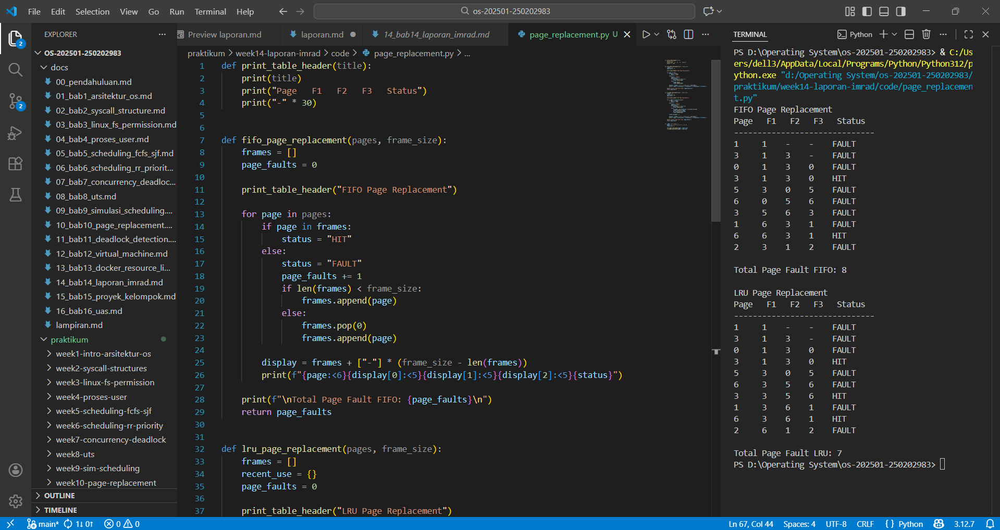

# Laporan Praktikum Minggu 14
Topik: Penyusunan Laporan Praktikum Format IMRAD

---

## Identitas
- **Nama**  : Sukmani Intan Jumala
- **NIM**   : 250202983
- **Kelas** : 1IKRA

---

# Analisis Algoritma Page Replacement  FIFO dan LRU

## 1. Pendahuluan  
### 1.1 Latar Belakang  
Manajemen memori merupakan salah satu fungsi penting dalam sistem operasi yang berperan dalam mengatur pemakaian memori utama agar lebih efisien. Karena kapasitas memori utama terbatas, sistem operasi menggunakan mekanisme proses *paging* dan *page replacement* untuk menentukan halaman mana yang harus diganti ketika memori sudah tidak mencukupi(Silberschatz et al., 2018).

Dalam *page replacement*, terdapat 2 algoritma dasar yang sering digunakan dan dipelajari adalah *First Come First Served* (FIFO) dan *Least Recently Used* (LRU). Algoritma FIFO melakukan penggantian halaman berdasarkan urutan masuknya halaman ke memori, sehingga halaman yang pertama kali masuk akan diganti lebih dulu tanpa memperhatikan apakah halaman tersebut masih sering diakses. Menurut Silberschatz et al. (2018), cara ini tergolong sederhana, tetapi kadang justru membuat halaman yang masih sering dipakai ikut terganti.

Berbeda dengan FIFO, algoritma LRU mengganti halaman yang paling lama tidak digunakan dengan melihat riwayat akses halaman. Tujuannya adalah mempertahankan halaman yang sering diakses agar tetap berada di memori sehingga jumlah *page fault* dapat ditekan (Tanenbaum & Bos, 2015). Namun, dibandingkan dengan FIFO, LRU lebih sulit diterapkan karena harus mencatat penggunaan setiap halaman.

Perbedaan karakteristik antara FIFO dan LRU membuat kinerja pengelolaan memori keduanya juga berbeda. Karena itu, praktikum ini dilakukan untuk membandingkan algoritma FIFO dan LRU berdasarkan jumlah *page fault* yang dihasilkan.

### 1.2 Rumusan Masalah
Adapun rumusan masalah yang diangkat dalam praktikum ini adalah sebagai berikut:
1. Bagaimana perbedaan kinerja algoritma FIFO dan LRU dalam proses penggantian halaman pada memori utama?
2. Algoritma manakah yang menghasilkan jumlah *page fault* lebih sedikit ketika diuji menggunakan *reference string* yang sama dan jumlah *frame* yang sama?
3. Apakah hasil simulasi algoritma FIFO dan LRU yang diperoleh melalui program Python sesuai dengan teori penggantian halaman yang dipelajari dalam sistem operasi?

### 1.3 Tujuan
Adapun tujuan dari praktikum ini adalah:
1. Mengimplementasikan algoritma penggantian halaman FIFO dan LRU menggunakan bahasa pemrograman Python.
2. Menganalisis kinerja algoritma FIFO dan LRU berdasarkan jumlah *page fault* yang dihasilkan.
3. Membandingkan hasil simulasi dengan teori algoritma penggantian halaman dalam sistem operasi.
4. Memahami pengaruh strategi penggantian halaman terhadap efisiensi penggunaan memori.

---

## 2. Metode
### 2.1 Lingkungan Uji
Praktikum ini dilakukan menggunakan perangkat lunak dan lingkungan sebagai berikut:
- Sistem Operasi: Windows
- Bahasa Pemrograman: Python
- Editor Kode: Visual Studio Code
- Metode eksekusi: Program dijalankan melalui terminal/*command prompt*

### 2.2 Langkah Eksperimen
1. Menyiapkan Dataset
   - Menentukan *reference string*.
   - Menentukan jumlah *frame* memori.
2. Implementasi Algoritma FIFO
   - Membuat program untuk mensimulasikan algoritma FIFO.
   - Setiap halaman yang masuk ke memori dicatat urutannya.
   - Ketika memori penuh, halaman yang pertama masuk akan digantikan.
   - Mencatat *page hit* dan *page fault* pada setiap akses halaman.
3. Implementasi Algoritma LRU
   - Membuat program untuk mensimulasikan algoritma LRU.
   - Program mencatat waktu atau urutan terakhir halaman digunakan.
   - Ketika memori penuh, halaman yang paling lama tidak digunakan akan digantikan.
   - Mencatat *page hit* dan *page fault* pada setiap akses halaman.
4. Eksekusi dan Pencatatan Hasil
   - Menjalankan program FIFO dan LRU menggunakan dataset yang sama.
   - Menampilkan hasil simulasi dalam bentuk tabel di terminal.
   - Menyimpan hasil eksekusi sebagai bukti pengujian.

### 2.3 Parameter/dataset
   - *Reference string*: `1, 3, 0, 3, 5, 6, 3, 1, 6, 2`
   - Jumlah *frame* memori: 3 memori
   - Algoritma yang diuji: FIFO dan LRU

### 2.4 Metode Pengukuran
Pengukuran kinerja algoritma dilakukan dengan cara:
- Menghitung jumlah *page fault* yang terjadi selama simulasi.
- Mengamati jumlah *page hit* sebagai indikator efisiensi penggunaan memori.
- Membandingkan total *page fault* antara algoritma FIFO dan LRU.
- Menyajikan hasil pengukuran dalam bentuk tabel untuk memudahkan analisis.

---

## 3. Hasil
### 3.1 Dokumentasi Hasil Uji 

### 3.2 Tabel Hasil Uji
1. Tabel Hasil Uji Simulasi Algoritma FIFO.

   | Page | F1 | F2 | F3 | Status |
   |:-----|:---|:---|:---|:-------|
   |1|1|-|-|FAULT|
   |3|1|3|-|FAULT|
   |0|1|3|0|FAULT|
   |3|1|3|0|HIT|
   |5|3|0|5|FAULT|
   |6|0|5|6|FAULT|
   |3|5|6|3|FAULT|
   |1|6|3|1|FAULT|
   |6|6|3|1|HIT|
   |2|3|1|2|FAULT|

   Total *Page Fault* FIFO: 8

2. Tabel Hasil Uji Simulasi Algoritma LRU.

   | Page | F1 | F2 | F3 | Status |
   |:-----|:---|:---|:---|:-------|
   |1|1|-|-|FAULT|
   |3|1|3|-|FAULT|
   |0|1|3|0|FAULT|
   |3|1|3|0|HIT|
   |5|3|0|5|FAULT|
   |6|3|5|6|FAULT|
   |3|3|5|6|HIT|
   |1|3|6|1|FAULT|
   |6|3|6|1|HIT|
   |2|6|1|2|FAULT| 

   Total *Page Fault* LRU: 7  
### 3.3 Tabel Perbandingan Hasil Uji

| Aspek | Prinsip Kerja | Jumlah Frame | Reference String | Jumlah Page Fault | Jumlah Page Hit | Efisiensi Penggunaan | Kompleksitas | Kinerja| 
|:------:|:-----:|:----:|:------:|:-----:|:----:|:------:|:-----:|:-----:|
|FIFO|Halaman yang pertama masuk akan diganti lebih dulu|3|10 halaman|8|2|Lebih rendah|Sederhana|Kurang optimal|
|LRU|Halaman yang paling lama tidak digunakan akan diganti|3|10 halaman|7|3|Lebih tinggi|Lebih kompleks|Lebih optimal|

### 3.4 Ringkasan Temuan
Berdasarkan hasil pengujian ditemukan beberapa poin utama sebagai berikut:
- Algoritma FIFO menghasilkan 8 *page fault* dan 2 *page hit*.
- Algoritma LRU menghasilkan 7 *page fault* dan 3 *page hit*.
- LRU memiliki jumlah *page fault* lebih sedikit dibandingkan FIFO.
- Dengan parameter yang sama, LRU menunjukkan performa yang lebih baik.

---

## 4. Pembahasan
### 4.1 Interpretasi hasil
Berdasarkan ringkasan temuan yang telah disajikan pada bagian sebelumnya, terlihat adanya perbedaan kinerja antara algoritma FIFO dan LRU pada simulasi yang dilakukan.  
Perbedaan kinerja tersebut dapat dipahami dari karakteristik algoritma yang digunakan, yaitu:  
- Algoritma LRU menghasilkan jumlah *page fault* lebih sedikit dibandingkan FIFO.
- LRU lebih efektif dalam memanfaatkan *frame* memori pada skenario pengujian.
- FIFO mengganti halaman hanya berdasarkan urutan kedatangan.
- LRU mengganti halaman yang paling lama tidak digunakan.
- Pola akses pada *reference string* lebih mendukung kinerja LRU.  

### 4.2 Keterbatasan
Meskipun hasil pengujian sesuai dengan teori yang dijelaskan dalam referensi, praktikum ini memiliki beberapa keterbatasan, antara lain:
- Pengujian hanya menggunakan satu *reference string*.
- Jumlah *frame* memori yang diuji terbatas.
- Simulasi dilakukan secara sederhana dan belum mencerminkan kondisi sistem operasi nyata.   

Oleh karena itu, hasil pengujian ini belum dapat digeneralisasikan untuk semua skenario penggunaan sistem.

### 4.3 Perbandingan teori/ekspektasi
Sebelum praktikum dilakukan, penulis memiliki ekspektasi bahwa algoritma LRU akan menghasilkan jumlah page fault yang lebih sedikit dibandingkan algoritma FIFO. Ekspektasi ini muncul karena LRU mempertimbangkan riwayat penggunaan halaman, sedangkan FIFO hanya melihat urutan kedatangan halaman ke memori tanpa memperhatikan apakah halaman tersebut masih sering digunakan atau tidak.

Ekspektasi tersebut sejalan dengan teori sistem operasi yang menyatakan bahwa algoritma LRU bekerja berdasarkan prinsip *locality of reference*, yaitu program cenderung mengakses halaman yang sama secara berulang dalam selang waktu tertentu. Dengan mengganti halaman yang paling lama tidak digunakan, LRU secara teori mampu mempertahankan halaman yang masih relevan di dalam memori, sehingga dapat menekan jumlah *page fault* (Silberschatz et al., 2018).

Sebaliknya, algoritma FIFO berpotensi mengganti halaman yang sebenarnya masih sering digunakan karena keputusan penggantian hanya didasarkan pada waktu masuk halaman ke memori. Menurut Tanenbaum dan Bos (2015), pendekatan ini dapat menyebabkan kinerja FIFO kurang optimal dibandingkan algoritma yang mempertimbangkan pola akses halaman.

Hasil praktikum yang diperoleh menunjukkan bahwa jumlah page fault pada algoritma LRU memang lebih sedikit dibandingkan FIFO. Dengan demikian, hasil eksperimen yang diperoleh sesuai dengan ekspektasi awal dan teori yang dipelajari, yaitu bahwa LRU memiliki kinerja yang lebih baik dalam mengelola memori dibandingkan FIFO pada *reference string* dan jumlah *frame* yang sama.

---

## 5. Kesimpulan
Kesimpulan dalam praktikum ini, sebagai berikut:
1. Praktikum ini berhasil mensimulasikan algoritma FIFO dan LRU pada proses *page replacement* menggunakan *reference string* dan jumlah *frame* yang sama.
2. Algoritma LRU menghasilkan jumlah page fault yang lebih sedikit dibandingkan FIFO, sehingga memiliki kinerja yang lebih baik dalam pengelolaan memori.
3. Algoritma yang mempertimbangkan riwayat penggunaan halaman (LRU) lebih efektif dibandingkan algoritma yang hanya berdasarkan urutan kedatangan halaman (FIFO).
4. Hasil praktikum sesuai dengan teori sistem operasi yang menyatakan bahwa LRU lebih optimal daripada FIFO dalam memanfaatkan prinsip *locality of reference*.

---

## 6. Quiz
1. **Mengapa format IMRAD membantu membuat laporan praktikum lebih ilmiah dan mudah dievaluasi?**  
Format IMRAD membantu menyusun laporan secara sistematis mulai dari latar belakang hingga kesimpulan, sehingga alur pemikiran menjadi jelas. Struktur ini memudahkan dalam memahami tujuan, metode, hasil, serta analisis yang dilakukan.
2. **Apa perbedaan antara bagian Hasil dan Pembahasan?**  
   - Bagian Hasil berisi penyajian data atau temuan dari eksperimen, seperti tabel dan angka hasil simulasi. Sementara itu, 
   - Bagian Pembahasan berisi penjelasan dan interpretasi terhadap hasil tersebut serta kaitannya dengan teori yang dipelajari.
3. **Mengapa sitasi dan daftar pustaka penting, bahkan untuk laporan praktikum?**  
Sitasi dan daftar pustaka penting untuk menunjukkan bahwa analisis yang dilakukan memiliki dasar teori yang jelas, menghargai sumber referensi, serta meningkatkan kredibilitas dan keilmiahan laporan.

---

## Daftar Pustaka
1. Silberschatz, A., Galvin, P. B., & Gagne, G. (2018). *Operating System Concepts* (10th ed.). Wiley.
2. Tanenbaum, A. S., & Bos, H. (2015). *Modern Operating Systems* (4th ed.). Pearson Education
