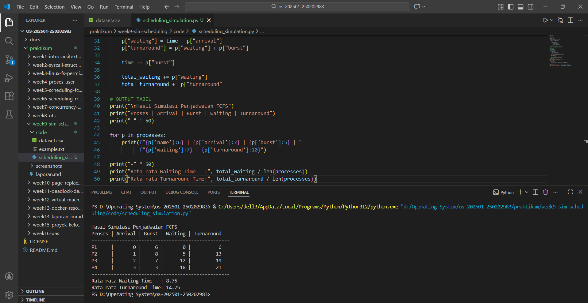

# Laporan Praktikum Minggu 9
Topik: Simulasi Algoritma Penjadwalan CPU  

---

## Identitas
- **Nama**  : Sukmani Intan Jumala
- **NIM**   : 250202983
- **Kelas** : 1 IKRA

---

## Tujuan
Setelah menyelesaikan tugas ini, mahasiswa mampu:
1. Membuat program simulasi algoritma penjadwalan FCFS dan/atau SJF.  
2. Menjalankan program dengan dataset uji yang diberikan atau dibuat sendiri.  
3. Menyajikan output simulasi dalam bentuk tabel atau grafik.  
4. Menjelaskan hasil simulasi secara tertulis.  
5. Mengunggah kode dan laporan ke Git repository dengan rapi dan tepat waktu.

---

## Dasar Teori
- Penjadwalan CPU, merupakan mekanisme yang dilakukan sistem operasi untuk menentukan urutan proses yang akan dijalankan oleh prosesor. Jumlah prosesor yang menunggu terkadang melebihi kapasitas CPU, maka sistem perlu mengatur gilira agar sumber daya dapat digunakan secara efisien (Silberschatz et al., 2018).
- Algoritma FCFS (First Come, First Served) adalah algoritma penjadwalan paling sederhana yang bekerja berdasarkan urutan kedatangan proses. Proses yang tiba terlebih dahulu akan dijalankan lebih dulu, begitupun sebaliknya.
- Algoritma SJF (Shortest Job First), bekerja dengan memilih proses yang memiliki waktu eksekusi paling singkat untuk dijalankan terlebih dahulu.
- Perbandingan FCFS dan SJF, FCFS lebih teratur dan mudah diterapkan, namun cenderung kurang efisien jika waktu proses bervariasi, sedangkan SJF dapat bekerja lebih cepat dan efisien secara keseluruhan, namun bisa membuat proses berdurasi panjang tertunda.

---

## Langkah Praktikum
1. **Menyiapkan Dataset**

   | Proses | Arrival Time | Burst Time |
   |:--:|:--:|:--:|
   | P1 | 0 | 6 |
   | P2 | 1 | 8 |
   | P3 | 2 | 7 |
   | P4 | 3 | 3 |

2. **Implementasi Algoritma**
   - Menghitung *waiting time* dan *turnaround time*.  
   - Mendukung minimal **1 algoritma (FCFS atau SJF non-preemptive)**.  
   - Menampilkan hasil dalam tabel.

3. **Eksekusi & Validasi**
   - Jalankan program menggunakan dataset uji.  
   - Pastikan hasil sesuai dengan perhitungan manual minggu sebelumnya.  
   - Simpan hasil eksekusi (screenshot).

4. **Analisis**
   - Jelaskan alur program.  
   - Bandingkan hasil simulasi dengan perhitungan manual.  
   - Jelaskan kelebihan dan keterbatasan simulasi.

5. **Commit & Push**
   ```bash
   git add .
   git commit -m "Minggu 9 - Simulasi Scheduling CPU"
   git push origin main
   ```
   
---

## Kode / Perintah
```bash
import csv
import os

# BACA DATASET
file_data = os.path.join(os.path.dirname(__file__), "dataset.csv")
processes = []

with open(file_data, "r") as file:
    reader = csv.reader(file)
    next(reader) # lewati header

    for row in reader:
        processes.append({
            "name": row[0],
            "arrival": int(row[1]),
            "burst": int(row[2])
        })

# urutkan berdasarkan arrival time (FCFS)
processes.sort(key=lambda x: x["arrival"])

# SIMULASI FCFS
time = 0
total_waiting = 0
total_turnaround = 0

for p in processes:
    if time < p["arrival"]:
        time = p["arrival"]

    p["waiting"] = time - p["arrival"]
    p["turnaround"] = p["waiting"] + p["burst"]

    time += p["burst"]

    total_waiting += p["waiting"]
    total_turnaround += p["turnaround"]

# OUTPUT TABEL
print("\nHasil Simulasi Penjadwalan FCFS")
print("Proses | Arrival | Burst | Waiting | Turnaround")
print("-" * 50)

for p in processes:
    print(f"{p['name']:6} | {p['arrival']:7} | {p['burst']:5} | "
          f"{p['waiting']:7} | {p['turnaround']:10}")

print("-" * 50)
print("Rata-rata Waiting Time   :", total_waiting / len(processes))
print("Rata-rata Turnaround Time:", total_turnaround / len(processes))
```

---

## Hasil Eksekusi


---

# Analisis  
- Alur Program
  Dalam praktikum ini, saya memutuskan untuk menggunakan algoritma FCFS. Pilihan ini bukan berarti saya menolak atau tidak ingin mempelajari lebih dalam tentang algoritma SJF. Tapi saya memilih algoritma FCFS karena saya sudah cukup memahami logikanya dan lebih mudah untuk saya analisis dan jelaskan. Berdasarkan program yang saya jalankan sebelumnya, berikut analisis alur nya:
   - Program dimulai dengan membaca dataset `dataset.csv`, Pada kode berikut:  
  ```bash
  with open(file_data, "r") as file:
    reader = csv.reader(file)
    next(reader) # lewati header

    for row in reader:
        processes.append({
            "name": row[0],
            "arrival": int(row[1]),
            "burst": int(row[2])
        })
  ```
  dapat dilihat bahwa setiap baris data diubah menjadi dictionary berisi name, arrival, dan burst. Dari kode ini, terlihat bahwa program menyiapkan struktur data yang memudahkan proses selanjutnya, terutama untuk pengurutan dan perhitungan waktu
   - Langkah berikutnya adalah mengurutkan proses berdasarkan arrival time:  
  ```bash
  processes.sort(key=lambda x: x["arrival"])
  ```
  Kode ini menunjukkan inti FCFS: proses dieksekusi sesuai urutan kedatangan. Dari sini, kita bisa melihat bahwa urutan proses sudah siap untuk simulasi.

   - Simulasi eksekusi dilakukan dengan blok berikut:
  ```bash
  for p in processes:
    if time < p["arrival"]:
        time = p["arrival"]

    p["waiting"] = time - p["arrival"]
    p["turnaround"] = p["waiting"] + p["burst"]

    time += p["burst"]
  ```
  Dari kode ini, terlihat logika penghitungan waiting time dan turnaround time. Jika CPU sedang idle ketika proses tiba, nilai time disesuaikan sehingga proses dapat langsung dieksekusi. Kemudian, waktu tunggu dan turnaround dihitung secara otomatis, dan total waktunya diakumulasi untuk menghitung rata-rata.
   - Hasil simulasi ditampilkan dalam bentuk tabel menggunakan kode:
  ```bash
  for p in processes:
    print(f"{p['name']:6} | {p['arrival']:7} | {p['burst']:5} | "
          f"{p['waiting']:7} | {p['turnaround']:10}")
  ```
  Dari sini, dapat dilihat semua informasi proses, mulai dari arrival dan burst, hingga waiting time dan turnaround time. Dengan cara ini, pembaca bisa langsung memahami urutan eksekusi setiap proses dan efektivitas algoritma FCFS.

- Bandingkan hasil simulasi dengan perhitungan manual
  Dari hasil program, diperoleh tabel simulasi sebagai berikut:
  
  |Proses|AT|BT|WT|TAT|
  |:---:|:--:|:--:|:--:|:--:|
  |P1|0|6|0|6|
  |P2|1|8|5|13|
  |P3|2|7|12|19|
  |P4|3|3|18|21|

  Dari hasil simulasi program FCFS, diperoleh rata-rata Waiting Time 8.75 dan rata-rata Turnaround Time 14.75. Jika dibandingkan dengan perhitungan manual yang dilakukan pada praktikum minggu sebelumnya(tepatnya minggu ke-5), hasilnya sama.  
  Hal ini menunjukkan bahwa logika program, mulai dari pengurutan proses berdasarkan arrival time hingga akumulasi waktu eksekusi, telah berjalan dengan benar. Simulasi otomatis ini juga mempermudah perhitungan dan mengurangi risiko kesalahan dibanding perhitungan manual.   
- Kelebihan dan keterbatasan simulasi  
  **Kelebihan:**
   - Penghitungan waktu tunggu dan turnaround dilakukan secara cepat dan akurat dari kode simulasi.
   - Struktur data dan logika program memudahkan analisis untuk dataset lebih besar
     
  **Keterbatasan:**
   - Bergantung pada akurasi dataset input.
   - Tidak memperhitungkan overhead context switching atau interupsi nyata pada OS  

---

## Kesimpulan  
Dari praktikum ini, tujuan utama yaitu mampu membuat program simulasi penjadwalan CPU telah tercapai. Dengan menjalankan program, saya belajar langsung bagaimana membaca dataset, mengurutkan proses, menghitung waiting time dan turnaround time, serta menampilkan hasilnya secara otomatis dalam bentuk tabel.

Pengalaman membuat program ini membuat saya lebih memahami bagaimana logika penjadwalan bekerja secara nyata, termasuk bagaimana proses menunggu dan dieksekusi. Praktikum ini juga memperlihatkan keterbatasan simulasi, seperti proses yang harus menunggu lama karena urutan eksekusi, sehingga saya menyadari fenomena Convoy Effect secara langsung.

Secara keseluruhan, praktikum ini membantu saya memahami logika penjadwalan CPU sekaligus praktik membuat simulasi program Python dengan lebih mudah dan nyata


---

## Quiz
1. Mengapa simulasi diperlukan untuk menguji algoritma scheduling?  
2. Apa perbedaan hasil simulasi dengan perhitungan manual jika dataset besar?  
3. Algoritma mana yang lebih mudah diimplementasikan? Jelaskan.

---

## Refleksi Diri
Tuliskan secara singkat:
- Apa bagian yang paling menantang minggu ini?  
- Bagaimana cara Anda mengatasinya?  

---

**Credit:**  
_Template laporan praktikum Sistem Operasi (SO-202501) – Universitas Putra Bangsa_
